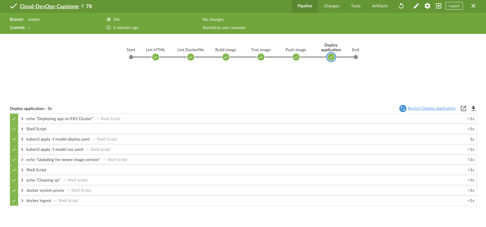
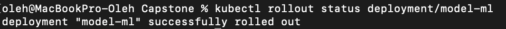
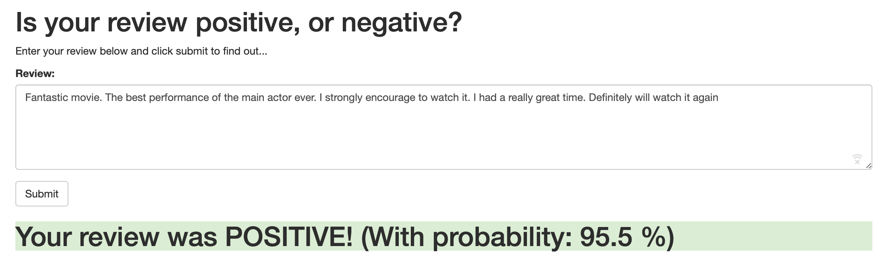

# Application Deployment on EKS Cluster using Jenkins

## Technologies
**Docker**: application containerization
<br>**Kubernetes(AWS EKS)**: for deployment, scaling, and management of containerized applications.
<br>**CloudFormation**: Automation of creation infrastructure on AWS
<br>**Jenkins**: for automatic integrations and deployments(CI/CD).
<br>**Python**: Example web application. Review rating using Sentiment Analysis model deployed in Flask backend

# Project Scope

This repository describes steps to perform Rolling deployment on EKS cluster using standalone Jenkins server.

## Create infrastructure

1. Create standalone Jenkins server

To create Jenkins server use CloudFormation scripts in: [jenkins folder](./jenkins-ec2)
<br>his will run Jenkins of EC2 and install all required dependencies.
<br>After Jenkins instance is running - ssh into instance using command similar to:
`ssh -i "jenkins-server-access.pem" ubuntu@yourEC2_DNS_Name`
<br>You will find password for setting up Jenkins in the current folder.

Setup necessary plugins for Jenkins.
<br>Recommended:
* BlueOcean
* AWS Steps
* Docker
* AquaMicroscanner
* Locale

Add necessary credentials into `Credentials` tab in Jenkins UI (you will need you IAM role credentials and credentials to access DockerHub repository).


2. Create EKS cluster

Spin up EKS cluster using `./cluster/eks-create-cluster.yaml` or using standalone CloudFormation provided in `cluster` folder.
<br> If first option is choosed, ensure that **eksctl** tool is installed.
[eksctl installation](https://eksctl.io/introduction/installation/)

By default if will create cluster with 3 nodes in different Availability Zones, with necessary VPC, Subnets, NatGateway and Application Load Balancer.

Ensure that you can run `kubectl get svc` command and see some services listed. This would mean that setup was successful.

### Adding the jenkins user to the aws-auth configmap
**Important!**
If you want to grant additional AWS users or roles the ability to interact with your EKS cluster, you must add the users/roles to the `aws-auth` ConfigMap within Kubernetes in the `kube-system` namespace.

Run:
```
  kubectl apply -f ./role/role/yaml
  kubectl apply -f ./role_binding.yaml
```

Next you need to get user IAM role ARN and specify it in EKS Cluster configuration.
```
kubectl edit configmap aws-auth -n kube-system
```

Add the user under the mapUsers as an item in the `aws-auth` ConfigMap:
```
data:
  mapUsers: |
    - userarn: arn:aws:iam::123456789012:user/jenkins  # or the IAM role used with Jenkins AWS Credentials
      username: eks-user
      groups:
      - eks-role
```

If the user is properly configured you should be able to list pods in the Cluster:

```
kubectl get pods --as eks-user
kubectl auth can-i create services --as eks-user
```

After these steps and assuming Jenkins server has been fully set up - you are free to continue and deploy an application specified using manifest files specified in `./k8s-manifests`.

Be sure to include at least Deployment and Service manifest for an application of your choice.

3. Deploy an application

Navigate to your Jenkins server and create Pipeline pointing to repository with Jenkinsfile in the root. Use provided Jenkinsfile as an example.

This will trigger deployment of an application in EKS Cluster using Rolling Deployment update strategy.

Example output of the Pipeline:


Status of deployment can be checked with `kubectl rollout status deployments/model-ml`




# Example Python ML application

Example application provided is a simple Flask web server hosting pre-trained Sentiment Analysis Machine Learning model.

You can type any review and instantly get feedback if it was Positive, Negative or Neutral with exact precision.

Simple web interface will look like the following:


You can learn more on how the application has been created, following steps in my other repository:
https://github.com/bdnf/SageMaker-RNN-with-API-Gateway

Necessary source files and Dockerfile for an application you can find in `./app` folder.

`k8s-manifests` folder contains necessary Kubernetes manifest files.
